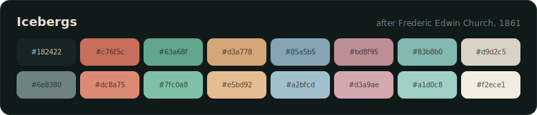

# dotfiles

My macOS setup, managed with [yadm](https://yadm.io). The repo's work tree is my actual home directory, so these are real files sitting where they belong. No symlink farm to babysit, and a new machine gets dressed in one command.

## Icebergs

I paint my own terminal palettes. The current one is **Icebergs**, pulled from Frederic Edwin Church's *The Icebergs* (1861).




<sup><em>The Icebergs</em>, Frederic Edwin Church, 1861. Dallas Museum of Art. Public domain.</sup>

The greens are the water, the cool blues are ice in shadow, the warm neutrals are that dusk sky, and the cursor is the wood of the wrecked mast in the foreground.

Ghostty reads the palette from `.config/ghostty/icebergs.conf`. VS Code gets the same colors through `workbench.colorCustomizations` in `settings.json`, layered over a translucent window (vscode-vibrancy). Neovim runs its own build of the theme, a single-file colorscheme at `.config/nvim/colors/icebergs.lua` with full treesitter and diagnostic highlights, and it keeps a transparent background so the terminal blur shows through. Zen Browser wears it as a `userChrome.css` in `.config/zen/chrome/`, and Obsidian gets a full theme (plus a parchment light mode) in `.config/obsidian/themes/Icebergs/`. One palette, five surfaces.

## What's inside

| Tool | Where |
| --- | --- |
| [Ghostty](https://ghostty.org) | `.config/ghostty/` |
| VS Code | `Library/Application Support/Code/User/settings.json` |
| zsh | `.zshrc`, `.zprofile` |
| [powerlevel10k](https://github.com/romkatv/powerlevel10k) | `.p10k.zsh` |
| Neovim | `.config/nvim/` ([LazyVim](https://www.lazyvim.org)) |
| [Zen Browser](https://zen-browser.app) | `.config/zen/chrome/userChrome.css` |
| [Obsidian](https://obsidian.md) | `.config/obsidian/themes/Icebergs/` |
| btop | `.config/btop/` |
| neofetch | `.config/neofetch/` |
| Homebrew | `.Brewfile` |

## New machine

```sh
brew install yadm
yadm clone https://github.com/dyascj/dotfiles.git
yadm bootstrap
```

`yadm clone` puts every file where it belongs. The [bootstrap script](.config/yadm/bootstrap) handles the rest: installs Homebrew if it's missing, runs `brew bundle --global` for everything in the Brewfile, installs my VS Code extensions from a saved list, and sets zsh as the default shell.

Zen and Obsidian hide their config behind machine-specific folder names (a random profile hash, per-vault settings), so those two are the exception to the no-symlinks rule: bootstrap finds the active Zen profile and every registered Obsidian vault, then links the theme files in from `.config`. Run `yadm bootstrap` again after the first launch of either app and it wires them up.

## Day to day

yadm is just git with your home directory as the work tree, so the muscle memory carries over:

```sh
yadm status
yadm add .config/ghostty/icebergs.conf
yadm commit -m "warmer cursor"
yadm push
```

Machine-specific stuff never touches the repo. `.zshrc` sources an untracked `~/.zshrc.local` at the end if one exists.
